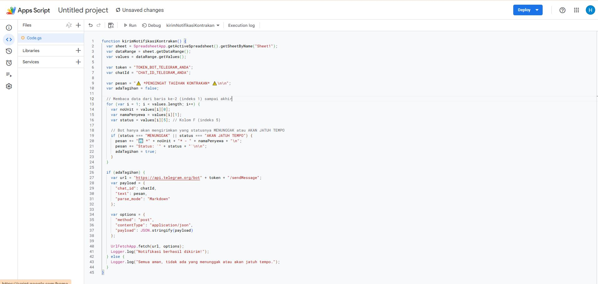
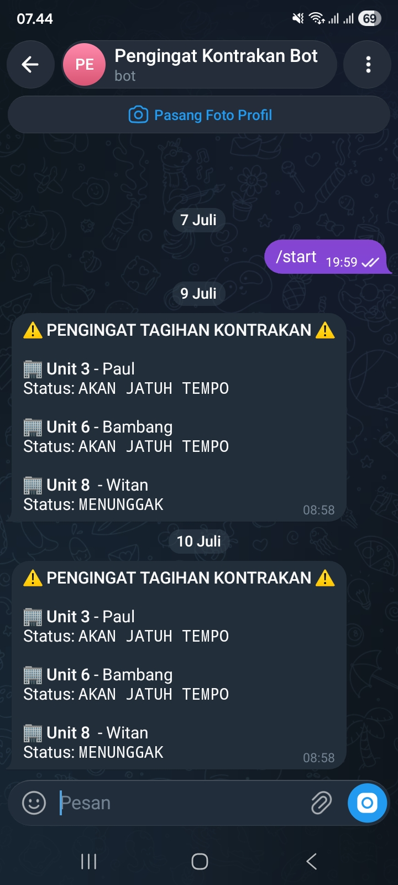
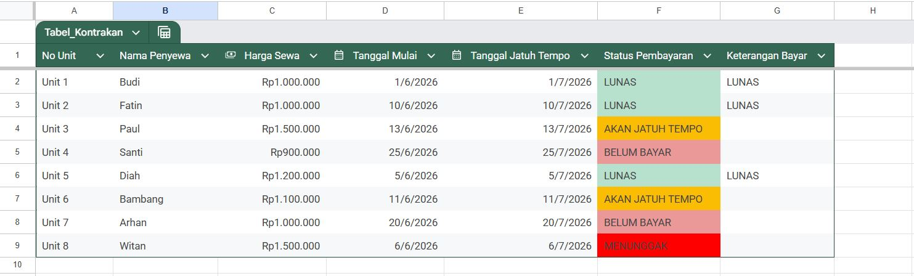

# PORTOFOLIO PROJECT: SISTEM MANAJEMEN KONTRAKAN DIGITAL & OTOMATISASI BOT TELEGRAM
## 1. Ringkasan Eksekutif (Executive Summary)
Projek ini merupakan rancangan sistem manajemen operasional dan keuangan untuk pengelolaan unit kontrakan berbasis digital. Menggunakan kombinasi Google Sheets sebagai database dan dashboard utama, serta Google Apps Script yang terintegrasi dengan Telegram Bot API, sistem ini mampu melakukan pelacakan status pembayaran penyewa secara real-time dan mengirimkan notifikasi penagihan harian secara otomatis ke ponsel pengelola tanpa intervensi manual.

## 2. Permasalahan & Solusi (Problem & Solution)
* **Permasalahan:** Pengelolaan banyak unit kontrakan secara manual sering kali menghadapi kendala keterlambatan penagihan akibat pengelola yang lupa mendeteksi tanggal jatuh tempo masing-masing penyewa. Penagihan manual satu per satu juga memakan waktu dan berisiko memicu kesalahan data (human error).

* **Solusi:** Membangun database adaptif dengan sistem pewarnaan otomatis (Conditional Formatting) yang mendeteksi kedekatan tanggal jatuh tempo dengan tanggal hari ini (real-time), dikombinasikan dengan bot pengingat otomatis (automated reminder bot) berbasis waktu (time-driven trigger).

## 3. Arsitektur Data & Struktur Tabel
Data diatur menggunakan objek tabel resmi pada Google Sheets dengan struktur kolom sebagai berikut:

| Nama Kolom | Tipe Data | Deskripsi / Fungsi |
| :--- | :--- | :--- |
| **No Unit** | Teks (String) | Identitas unik untuk setiap unit kontrakan (e.g., Unit 1, Unit 2). |
| **Nama Penyewa** | Teks (String) | Nama dari penyewa yang menempati unit tersebut. |
| **Harga Sewa** | Mata Uang (Currency) | Nominal biaya sewa bulanan dengan format IDR (Rupiah). |
| **Tanggal Mulai** | Tanggal (Date) | Tanggal awal dimulainya siklus sewa bulan berjalan (Format: DD/MM/YYYY). |
| **Tanggal Jatuh Tempo** | Tanggal (Date) | Batas akhir pembayaran sewa pada bulan berjalan (Format: DD/MM/YYYY). |
| **Status Pembayaran** | Rumus (Formula) | Status kalkulasi otomatis kondisi keuangan penyewa. |
| **Keterangan** | Teks / Input | Kolom kontrol untuk memasukkan kata "Lunas" jika penyewa sudah membayar. |

## 4. Logika Status & Aturan Pewarnaan (Conditional Formatting)
Sistem menggunakan satu rumus pusat berskala besar (ARRAYFORMULA) pada Kolom Status untuk memproses seluruh baris secara otomatis:

1. **LUNAS (Warna Latar Hijau Muda):**
   * *Logika:* Terjadi ketika kolom Keterangan diisi teks "Lunas".
   * *Arti:* Penyewa sudah menyelesaikan kewajiban pembayaran untuk siklus bulan tersebut.

2. **BELUM BAYAR (Warna Latar Abu-abu/Merah Muda Tipis):**
   * *Logika:* Terjadi saat memasuki bulan sewa baru, namun tanggal jatuh tempo masih jauh (lebih dari 5 hari dari tanggal hari ini).
   * *Arti:* Penyewa belum membayar, tetapi belum jatuh tempo dan belum memasuki masa krusial.

3. **AKAN JATUH TEMPO (Warna Latar Kuning):**
   * *Logika:* Sistem mendeteksi bahwa selisih tanggal jatuh tempo dikurangi tanggal hari ini sudah mencapai 5 hari atau kurang.
   * *Arti:* Aba-aba bagi pengelola untuk bersiap melakukan penagihan atau mengirimkan reminder.

4. **MENUNGGAK (Warna Latar Merah):**
   * *Logika:* Tanggal hari ini telah melewati (expired) tanggal jatuh tempo yang tertera dan kolom Keterangan belum diisi "Lunas".
   * *Arti:* Penyewa terlambat membayar dan pengelola harus segera menindaklanjuti tagihan tersebut.
  
## 5. Implementasi Kode & Otomatisasi (Google Apps Script)
Otomatisasi dibangun menggunakan Google Apps Script berbasis JavaScript untuk membaca baris tabel secara berkala, memfilter unit yang membutuhkan perhatian khusus (AKAN JATUH TEMPO atau MENUNGGAK), dan mengirimkannya ke Telegram API.

**Kode Program yang Digunakan:**

## 6. Pengaturan Trigger (Pemicu Otomatis)
Sistem ini tidak memerlukan eksekusi manual tombol "Run". Pengelola memasang Time-driven Trigger dengan tipe Day Timer yang disetel untuk mengesekusi fungsi kirimNotifikasiKontrakan setiap hari pada pukul 08.00 - 09.00 AM. Melalui konfigurasi ini, pengelola akan menerima laporan tagihan harian langsung di aplikasi Telegram HP secara konsisten.

**Notifikasi Otomatis yang Diterima di Telegram HP**

## 7. Kesimpulan & Dampak Project
Projek ini berhasil memangkas waktu pengecekan data tagihan properti dari yang sebelumnya dilakukan manual menjadi sepenuhnya otomatis. Dengan adanya pembagian visual warna yang jelas di Google Sheets serta notifikasi push-notification langsung ke Telegram, potensi keterlambatan penagihan sewa dapat ditekan hingga 0%, sekaligus menjaga stabilitas cash flow keuangan usaha kontrakan.

## Tampilan Dashboard Google Sheets

## 🔗 Link Google Sheets (Live Preview): [https://docs.google.com/spreadsheets/d/1Wb2usytiOPncapq1m9AobPZ16XdBYwehvqsiCIGiHoI/edit?usp=sharing]
